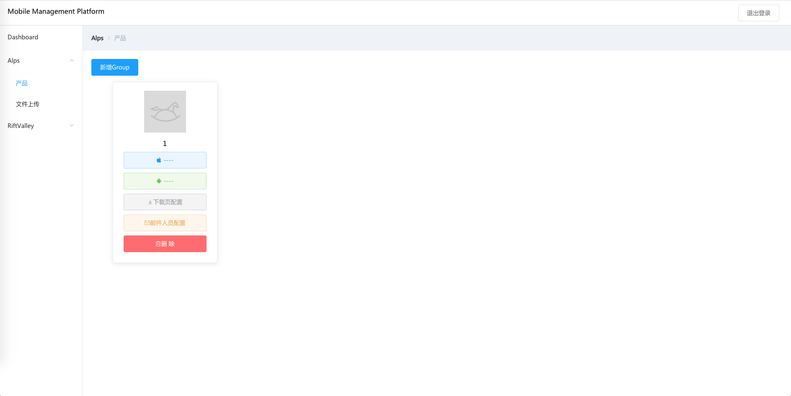

###移动发布平台
    
    类pgyer，fir工具，支持私有化，可用于生产环境，代码完全开放。

##目的

    降低测试和研发沟通成本，快速安装和发布包

##使用方式
	
1. 该项目共两端，服务端为python代码，客服端为vue项目。
	默认会访问当前地址，建议部署在同一台机子上，我使用的pm2进行部署
  
2. 该项目提供接口给jenkins或者其他发包平台，以方便包的上传和分发，具体参照distribution/alps/urls.py 中 upload 相关

3. 登录账号密码: admin / caiwenshu

4. 前端页面配置: https://github.com/caiwenshu/mdp_frontend

5. 下载页配置: https://github.com/caiwenshu/mdp_download

##使用截图
  
  
 
 
 
 
 
 
 
 
 
 
 
 
 


##流程图


##安装


### Python 虚拟环境

```
pip install virtualenv

virtualenv my_env
source my_env/bin/activate

```
   
 pip install -r requirements.txt


```angular2html

安卓反解析工具类 apktool: https://ibotpeaches.github.io/Apktool/

https://ibotpeaches.github.io/Apktool/install/

```

```shell

jdk安装

wget --no-cookies --no-check-certificate --header "Cookie: gpw_e24=http%3A%2F%2Fwww.oracle.com%2F; oraclelicense=accept-securebackup-cookie" "http://download.oracle.com/otn-pub/java/jdk/8u141-b15/336fa29ff2bb4ef291e347e091f7f4a7/jdk-8u141-linux-x64.tar.gz"
```

初始化admin模块 执行
	
	python manage.py migrate


https://docs.djangoproject.com/en/1.10/intro/tutorial02/


#创建超级用户
python manage.py createsuperuser


##问题1：
使用

### Python 虚拟环境

```
pip install virtualenv

virtualenv my_env
source my_env/bin/activate

```

后，
```
(distribution_env) caiwenshus-MacBook-Pro-2:MobileDistributionPlatform caiwenshu$ pip install --trusted-host pypi.org --trusted-host files.pythonhosted.org Django==1.10.5
Collecting Django==1.10.5
  Could not fetch URL https://pypi.python.org/simple/django/: There was a problem confirming the ssl certificate: [SSL: TLSV1_ALERT_PROTOCOL_VERSION] tlsv1 alert protocol version (_ssl.c:590) - skipping
  Could not find a version that satisfies the requirement Django==1.10.5 (from versions: )
```

通过查看pip -V ,pip的版本为9.0.1

执行命令:
	curl https://bootstrap.pypa.io/get-pip.py | python

升级pip为 pip 18.1 ，解决该问题


